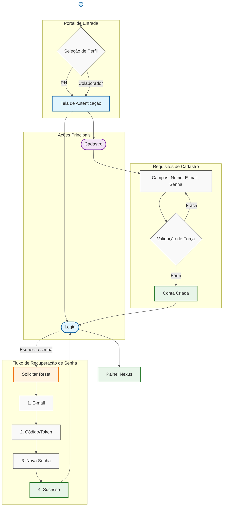
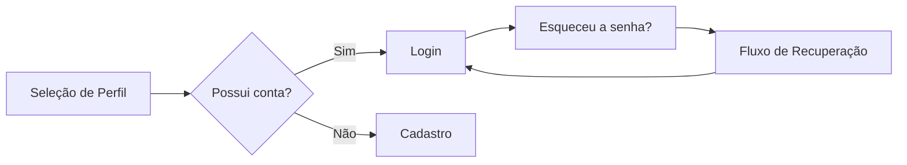

# Tela de Login
O módulo de autenticação da Nexus foi projetado para oferecer uma experiência personalizada desde o primeiro contato, 
garantindo que a interface se adapte ao nível de permissão do usuário.

---

### Estrutura de Arquivos

```
nexus/
├── screens/
│   └── login.html          # Markup principal da tela
├── styles/
│   └── login.css           # Estilos da tela
├── javascript/
│   └── login.js            # Lógica e interações
└── assets/
    └── image.jpeg          # Imagem do painel esquerdo
```
---

### Diagramas do Fluxo



---



---

### Regras de Segurança e UX
* **Validação de Força de Senha:** O cadastro exige senhas com caracteres especiais, números e letras maiúsculas.
* **Feedback em Tempo Real:** Mensagens de erro para campos vazios ou formatos de e-mail inválidos.

---

### Tecnologias Utilizadas

- HTML
- CSS
- JavaScript
